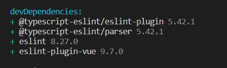

# 配置 eslint

ESLint 是一个根据方案识别并报告 ECMAScript/JavaScript 代码问题的工具，其目的是使代码风格更加一致并避免错误。

## 安装

```bash
# 运行下面命令，根据项目需要选择,创建eslint.js
npm init @eslint/config
```

#### 1-依次初始化选项

```
(1) How would you like to use ESLint?
选择：To check syntax and find problems

(2) What type of modules does your project use?
选择：JavaScript modules (import/export)

(3) Which framework does your project use?
选择：Vue.js

(4) Does your project use TypeScript?
选择：Yes

(5) Where does your code run?
选择：Browser

(6) What format do you want your config file to be in?
选择：JavaScript

(7) Would you like to install them now?
选择：Yes

(8) Which package manager do you want to use?
选择：pnpm
```

安装依赖成功，创建 eslint.js



#### 2-解决 eslint 找不到 module 的报错

此时打开`.eslintrc.js`配置文件会出现一个报错，需要再`env`字段中增加`node: true`配置以解决 eslint 找不到 module 的报错

由于我们是 vue3 项目, 把下面的 "plugin:vue/essential",替换成"plugin:vue/vue3-essential"

```js
module.exports = {
  env: {
    browser: true,
    node: true,
    es2021: true
  },
  extends: [
    'eslint:recommended',
    //"plugin:vue/essential",
    'plugin:vue/vue3-essential',
    'plugin:@typescript-eslint/recommended'
  ],
  parserOptions: {
    ecmaVersion: 'latest',
    parser: '@typescript-eslint/parser',
    sourceType: 'module'
  },
  plugins: ['vue', '@typescript-eslint'],
  rules: {}
}
```

#### 3.在 package.json 文件中的 script 中添加 lint 命令

```bash
{
    "scripts": {
        // eslint . 为指定lint当前项目中的文件
        // --ext 为指定lint哪些后缀的文件
        // --fix 开启自动修复
        "lint": "eslint . --ext .vue,.js,.ts,.jsx,.tsx --fix"
    }
}
```

执行

```bash
pnpm lint
```

可以看到有一些错误


#### 4-解决 eslint 扫描出来的错误

##### 4.1 错误 1 vue 文件 `parsing error`

上面有一个 app.vue 错误，就是在解析`.vue`后缀的文件时候出现解析错误`parsing error`。

查阅资料后发现，`eslint`默认是不会解析`.vue`后缀文件的。因此，需要一个额外的解析器来解析`.vue`后缀文件。

但是我们查看`.eslintrc.js`文件中的`extends`会发现已经有继承`"plugin:vue/vue3-essential"`的配置。然后在`node_modules`中可以找到`eslint-plugin-vue/lib/cinfigs/essential`，里面配置了`extends`是继承于同级目录下的`base.js`，在里面会发现`parser: require.resolve('vue-eslint-parser')`这个配置。因此，按道理来说应该是会解析`.vue`后缀文件的。

继续往下看`.eslintrc.js`文件中的`extends`会发现，`extends`中还有一个`"plugin:@typescript-eslint/recommended"`，它是来自于`/node_modules/@typescript-eslint/eslint-plugin/dist/configs/recommended.js`，查看该文件会发现最终继承于同级目录下的`base.js`文件。从该文件中可以发现`parser: '@typescript-eslint/parser',`配置。

按照`.eslintrc.js`文件中的`extends`配置的顺序可知，最终导致报错的原因就是`@typescript-eslint/parser`把`vue-eslint-parser`覆盖了。

```js
{
    "extends": [
        "eslint:recommended",
        "plugin:vue/vue3-essential",
        "plugin:@typescript-eslint/recommended"
    ],
}
```

修改`.eslintrc.js`文件

```bash
 "parser": "vue-eslint-parser"

 # 全部
 module.exports = {
    "env": {
        "browser": true,
        "node": true,
        "es2021": true
    },
    "extends": [
        "eslint:recommended",
        "plugin:vue/essential",
        "plugin:@typescript-eslint/recommended"
    ],
    "parser": "vue-eslint-parser",
    "parserOptions": {
        "ecmaVersion": "latest",
        "parser": "@typescript-eslint/parser",
        "sourceType": "module"
    },
    "plugins": [
        "vue",
        "@typescript-eslint"
    ],
    "rules": {
    }
}

```

##### 4.2 错误 2

> typescript 报错：Don‘t use `{}` as a type. `{}` actually means “any non-nullish value“


在.eslintrc.js 中添加 rules 配置

```js
// .eslintrc.js
"rules": {
    "@typescript-eslint/ban-types": [
      "error",
      {
        "extendDefaults": true,
        "types": {
          "{}": false
        }
      }
    ]
  }
```

##### 4.3 错误 3.any 错误

> warning Unexpected any. Specify a different type @typescript-eslint/no-explicit-any

解决方案：关闭 any 类型的警告。

```js
// 在 .eslintrc.js文件中找到rules 添加一行代码即可
"@typescript-eslint/no-explicit-any": ["off"]
```

解决完上面三个问题 在执行`pnpm lint ` 就发现没问题了

## 安装 vscode 插件 ESLint

如果写一行代码就要执行一遍`lint`命令，这效率就太低了。所以我们可以配合 vscode 的`ESLint`插件，实现每次保存代码时，自动执行`lint`命令来修复代码的错误。

在项目中新建`.vscode/settings.json`文件，然后在其中加入以下配置。

```json
{
  // 开启自动修复
  "editor.codeActionsOnSave": {
    "source.fixAll": false,
    "source.fixAll.eslint": true
  }
}
```

**package.json 安装依赖说明**

- eslint： JavaScript 和 JSX 检查工具
- eslint-plugin-vue： 使用 ESLint 检查 .vue 文件 的 `<template>` 和 `<script>`，以及`.js`文件中的 Vue 代码

## eslint 规则解释

### [vue3-essential 文件解读](https://eslint.vuejs.org/rules/no-deprecated-data-object-declaration.html)

```js
/*
 * IMPORTANT!
 * This file has been automatically generated,
 * in order to update its content execute "npm run update"
 */
module.exports = {
  extends: require.resolve('./base'),
  rules: {
    //此规则要求组件名称始终为多个单词
    'vue/multi-word-component-names': 'error',
    // 不允许在定义观察者时使用箭头函数
    'vue/no-arrow-functions-in-watch': 'error',
    // 防止在计算属性和函数中调用异步方法。
    'vue/no-async-in-computed-properties': 'error',
    // 报告具有覆盖该子内容的指令的元素的子内容。默认情况下，这些是v-html和v-text
    'vue/no-child-content': 'error',
    // 不允许访问data（）中的计算属性。无法在data（）中访问计算属性，因为它在初始化之前。
    'vue/no-computed-properties-in-data': 'error',
    // 报告在数据属性上使用不推荐使用的对象声明（在Vue.js 3.0.0+中）。与vue/no共享组件数据不同的是，根实例也被禁止。
    'vue/no-deprecated-data-object-declaration': 'error',
    // 已弃用的销毁和销毁前生命周期挂钩的使用情况 beforeDestroy和destroyed
    'vue/no-deprecated-destroyed-lifecycle': 'error',
    // 不推荐使用的$listeners
    'vue/no-deprecated-dollar-listeners-api': 'error',
    // 不推荐使用的$scopedSlot
    'vue/no-deprecated-dollar-scopedslots-api': 'error',
    // 不推荐的$on、$off$once api
    'vue/no-deprecated-events-api': 'error',
    // 不推荐使用的过滤器语法
    'vue/no-deprecated-filter': 'error',
    // 不推荐使用功能模板 functional
    'vue/no-deprecated-functional-template': 'error',
    // 此规则报告HTML元素上已弃用的is属性
    'vue/no-deprecated-html-element-is': 'error',
    // 不推荐使用的内联模板属性
    'vue/no-deprecated-inline-template': 'error',
    // props默认值工厂函数中使用此项。在Vue。js3.0.0+，props默认值工厂函数不再具有访问权限。
    'vue/no-deprecated-props-default-this': 'error',
    // RouterLink元素上的标记属性【tag】已弃用
    'vue/no-deprecated-router-link-tag-prop': 'error',
    // This rule reports deprecated scope attribute in Vue.js v2.5.0+.
    'vue/no-deprecated-scope-attribute': 'error',
    // This rule reports deprecated slot attribute in Vue.js v2.6.0+.
    'vue/no-deprecated-slot-attribute': 'error',
    // This rule reports deprecated slot-scope attribute in Vue.js v2.6.0+.
    'vue/no-deprecated-slot-scope-attribute': 'error',
    // 不推荐使用的.sync修饰符
    'vue/no-deprecated-v-bind-sync': 'error',
    // Vue中已弃用的v-is指令。js v3.1.0+。
    'vue/no-deprecated-v-is': 'error',
    // v-on指令（在Vue.js 3.0.0+中）上使用不推荐的.native修饰符
    'vue/no-deprecated-v-on-native-modifier': 'error',
    //不推荐使用的KeyboardEvent。v-on指令上的keyCode修饰符（在Vue.js 3.0.0+中）。
    'vue/no-deprecated-v-on-number-modifiers': 'error',
    // 不推荐使用的Vue.config。keyCodes
    'vue/no-deprecated-vue-config-keycodes': 'error',
    // 防止重复的属性名称。
    'vue/no-dupe-keys': 'error',
    // 不允许在同一v-if/v-else-if链中出现重复条件。
    'vue/no-dupe-v-else-if': 'error',
    // 报告重复的属性。v-bind:foo指令作为属性foo处理。
    'vue/no-duplicate-attributes': 'error',
    'vue/no-export-in-script-setup': 'error',
    'vue/no-expose-after-await': 'error',
    'vue/no-lifecycle-after-await': 'error',
    'vue/no-mutating-props': 'error',
    'vue/no-parsing-error': 'error',
    'vue/no-ref-as-operand': 'error',
    'vue/no-reserved-component-names': 'error',
    'vue/no-reserved-keys': 'error',
    'vue/no-reserved-props': 'error',
    'vue/no-setup-props-destructure': 'error',
    'vue/no-shared-component-data': 'error',
    'vue/no-side-effects-in-computed-properties': 'error',
    'vue/no-template-key': 'error',
    'vue/no-textarea-mustache': 'error',
    'vue/no-unused-components': 'error',
    'vue/no-unused-vars': 'error',
    'vue/no-use-computed-property-like-method': 'error',
    'vue/no-use-v-if-with-v-for': 'error',
    'vue/no-useless-template-attributes': 'error',
    'vue/no-v-for-template-key-on-child': 'error',
    'vue/no-v-text-v-html-on-component': 'error',
    'vue/no-watch-after-await': 'error',
    'vue/prefer-import-from-vue': 'error',
    'vue/require-component-is': 'error',
    'vue/require-prop-type-constructor': 'error',
    'vue/require-render-return': 'error',
    'vue/require-slots-as-functions': 'error',
    'vue/require-toggle-inside-transition': 'error',
    'vue/require-v-for-key': 'error',
    'vue/require-valid-default-prop': 'error',
    'vue/return-in-computed-property': 'error',
    'vue/return-in-emits-validator': 'error',
    'vue/use-v-on-exact': 'error',
    'vue/valid-attribute-name': 'error',
    'vue/valid-define-emits': 'error',
    'vue/valid-define-props': 'error',
    'vue/valid-next-tick': 'error',
    'vue/valid-template-root': 'error',
    'vue/valid-v-bind': 'error',
    'vue/valid-v-cloak': 'error',
    'vue/valid-v-else-if': 'error',
    'vue/valid-v-else': 'error',
    'vue/valid-v-for': 'error',
    'vue/valid-v-html': 'error',
    'vue/valid-v-if': 'error',
    'vue/valid-v-is': 'error',
    'vue/valid-v-memo': 'error',
    'vue/valid-v-model': 'error',
    'vue/valid-v-on': 'error',
    'vue/valid-v-once': 'error',
    'vue/valid-v-pre': 'error',
    'vue/valid-v-show': 'error',
    'vue/valid-v-slot': 'error',
    'vue/valid-v-text': 'error'
  }
}
```

## eslint 字段解释

```js
// ESLint 配置文件遵循 commonJS 的导出规则，所导出的对象就是 ESLint 的配置对象
// 文档：https://eslint.bootcss.com/docs/user-guide/configuring
module.exports = {
  // 表示当前目录即为根目录，ESLint 规则将被限制到该目录下
  root: true,
  // env 表示启用 ESLint 检测的环境
  env: {
    // 在 node 环境下启动 ESLint 检测
    node: true
  },
  // ESLint 中基础配置需要继承的配置
  extends: ["plugin:vue/vue3-essential", "@vue/standard"],
  // 解析器
  parserOptions: {
    parser: "babel-eslint"
  },
  // 需要修改的启用规则及其各自的错误级别
  /**
   * 错误级别分为三种：
   * "off" 或 0 - 关闭规则
   * "warn" 或 1 - 开启规则，使用警告级别的错误：warn (不会导致程序退出)
   * "error" 或 2 - 开启规则，使用错误级别的错误：error (当被触发的时候，程序会退出)
   */
  rules: {
    "no-console": process.env.NODE_ENV === "production" ? "warn" : "off",
    "no-debugger": process.env.NODE_ENV === "production" ? "warn" : "off",<br>　　 // key：对应的规则 value：错误级别<br>　　 "quotes": "off"
  }
};
　　
```

# 参考文档

[在 vue3 、ts、vite 项目中使用 eslint与prettier与stylelint与husky的详细指南]: https://www.swvq.com/article/detail/471
[eslint中文配置文档]: https://eslint.bootcss.com/docs/user-guide/configuring
[eslint中文文档]: https://zh-hans.eslint.org/
[eslint-plugin-vue rules]: https://eslint.vuejs.org/rules/
[eslint-plugin npm文档]: https://www.npmjs.com/package/@typescript-eslint/eslint-plugin/v/4.29.2-alpha.5
